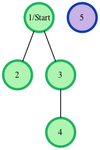
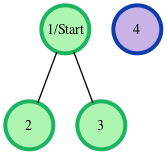
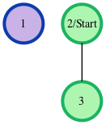

## Breadth First Search: Shortest Reach  
Consider an undirected graph where each edge weighs 6 units. Each of the nodes is labeled consecutively from 1 to n.

You will be given a number of queries. For each query, you will be given a list of edges describing an undirected graph. After you create a representation of the graph, you must determine and report the shortest distance to each of the other nodes from a given starting position using the breadth-first search algorithm (BFS). Return an array of distances from the start node in node number order. If a node is unreachable, return -1 for that node.

#### Example  
The following graph is based on the listed inputs:



$n = 5$ // number of nodes
$m = 3$ // number of edges
$edges = [[1, 2], [1, 3], [3, 4]]$
$s = 1$ // starting node

All distances are from the start node $1$. Outputs are calculated for distances to nodes $2$ through $5$: $[6, 6, 12, -1]$. Each edge is $6$ units, and the unreachable node $5$ has the required return distance of $-1$.

**Function Description**

Complete the `bfs` function in the editor below. If a node is unreachable, its distance is $-1$.

`bfs` has the following parameter(s):

* `int n`: the number of nodes
* `int m`: the number of edges
* `int edges[m][2]`: start and end nodes for edges
* `int s`: the node to start traversals from

**Returns**

`int[n-1]`: the distances to nodes in increasing node number order, not including the start node (-1 if a node is not reachable)

**Input Format**

The first line contains an integer $q$, the number of queries. Each of the following $q$ sets of lines has the following format:

* The first line contains two space-separated integers $n$ and $m$, the number of nodes and edges in the graph.
* Each line $i$ of the $m$ subsequent lines contains two space-separated integers, $u$ and $v$, that describe an edge between nodes $u$ and $v$.
* The last line contains a single integer, $s$, the node number to start from.

**Constraints**

* $1 \leq q \leq 10$
* $2 \leq n \leq 1000$
* $1 \leq m \leq \frac{n \cdot (n-1)}{2}$
* $1 \leq u, v, s \leq n$

**Sample Input**

```
2
4 2
1 2
1 3
1
3 1
2 3
2
```
#### Sample Output
```
6 6 -1
-1 6
```

### Explanation 
We perform the following two queries:  
1. The given graph can be represented as:  





where our start node, $s$, is node $1$. The shortest distances from $s$ to the other nodes are one edge to node $2$, one edge to node $3$, and an infinite distance to node $4$ (which it is not connected to). We then return an array of distances from node $1$ to nodes $2$, $3$, and $4$ (respectively): $[6, 6, -1]$.

2. The given graph can be represented as:



where our start node, $s$, is node $2$. There is only one edge here, so node $1$ is unreachable from node $2$ and node $3$ has one edge connecting it to node $2$. We then return an array of distances from node $2$ to nodes $1$, and $3$ (respectively): $[-1, 6]$.

**Note:** Recall that the actual length of each edge is $6$, and we return $-1$ as the distance to any node that is unreachable from $s$.